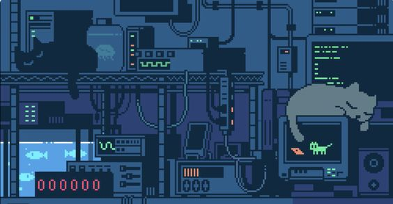

# Walkie-Talkie Chat App

### Hey, I am [Sheba Sulthana](linkedin.com/in/sheba-sulthana-9259b2222). I have made a chat app using reactJS and socket.io.
Have a look on it. https://ShebaSulthana.github.io/Walkie-Talkie/



A simple real-time chat application built with Node.js and Socket.io. The project features a pixel art aesthetic and allows multiple users to connect and exchange messages in real-time. This project is a playful experiment in combining a chat application with a retro, tech-inspired visual theme.

## Features

- **Real-time communication**: Uses Socket.io to facilitate real-time messaging between users.
- **Retro Pixel Art Interface**: The user interface is designed with a nostalgic pixel art theme.
- **User Join/Leave Notifications**: Users are notified when others join or leave the chat.
- **Message Display**: Messages are displayed with different styles for the user and others.

## Installation

To run this project locally, follow these steps:

1. Clone the repository:

    ```bash
    git clone https://github.com/yourusername/walkie-talkie.git
    cd walkie-talkie
    ```

2. Install the required dependencies:

    ```bash
    npm install
    ```

3. Start the server:

    ```bash
    npm run devStart
    ```

4. Open your browser and go to `http://localhost:3000` to access the chat application.

## Project Structure

- **index.html**: The main HTML file containing the structure of the chat interface.
- **script.js**: Handles the client-side logic for sending and receiving messages.
- **server.js**: The server-side code that manages user connections and message broadcasting.
- **package.json & package-lock.json**: Defines the dependencies and scripts for the project.
- **1.jpg**: The background image used in the chat interface.

## Dependencies

- **Node.js**
- **Socket.io**: For real-time bidirectional communication.
- **Nodemon**: Used during development to automatically restart the server on file changes.

## Usage

1. **Start the Server**: Run the command `npm run devStart` to start the server.
2. **Join the Chat**: Open a browser window and navigate to `http://localhost:3000`. Enter your name when prompted to join the chat.
3. **Send Messages**: Type your message in the input field and press "Send". Your message will appear in the chat, along with messages from other connected users.


## Contributing

Contributions are welcome! Feel free to fork this project, submit pull requests, or open issues for any bugs or feature requests.

## Acknowledgments

- Special thanks to the creators of the pixel art background, which adds a unique aesthetic to the application.
- The Node.js and Socket.io communities for providing the tools necessary to create this project.


